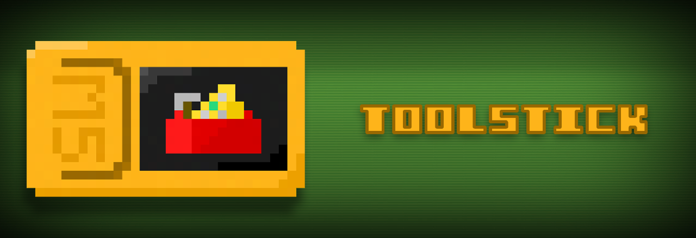

# 🧰 ToolStick
ToolStick is a toolbox-like firmware for the M5StickC Plus 2 that's made for providing useful tools and fun games.

# ⚙️ Features

**Looks**
- 🔧 Smooth and Minimal UI

**Tools**
- 🔧 WiFi AP Control Panel and More
- 🔧 Bluetooth (Media Controller)
- 🔧 Digital Level
- 🔧 Compass
- 🔧 Stop Watch
- 🔧 Timer
- 🔧 Real Time Clock
- 🔧 IR Remote

**Games/Fun**
- 🔧 Clicker Game
- 🔧 Text Based Games (Serial)
- 🔧 Random Number Generator
- 🔧 Beeper
- 🔧 8-Ball

**Settings/Info**
- 🔧 Brightness
- 🔧 Battery Stats
- 🔧 Sleep
- 🔧 Restart
- 🔧 Shutdown

